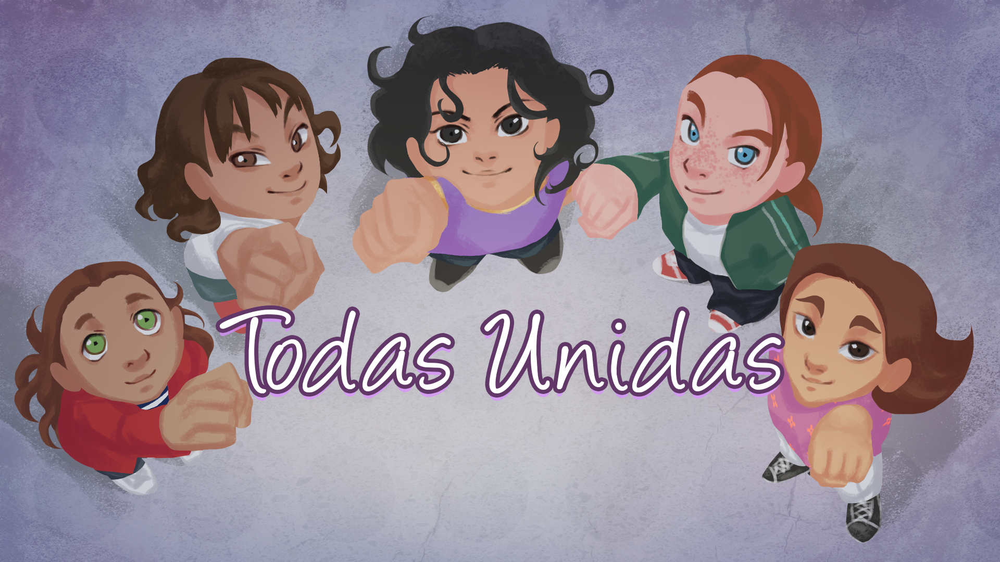
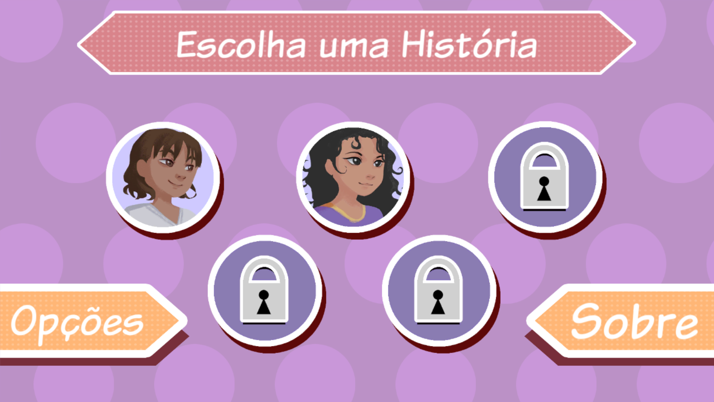
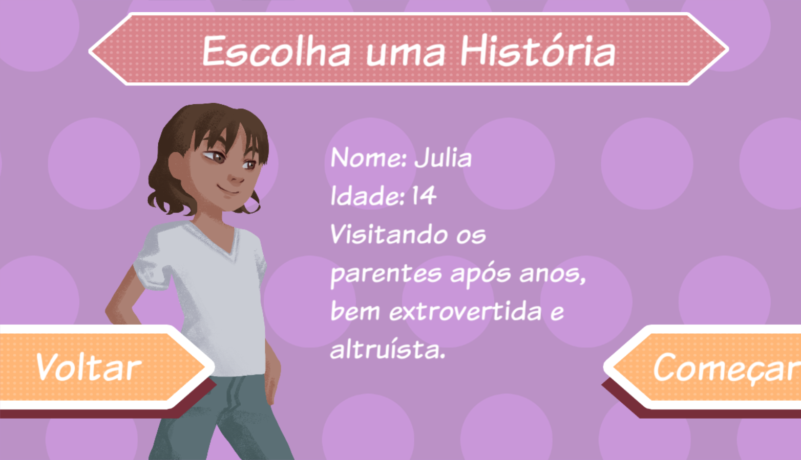
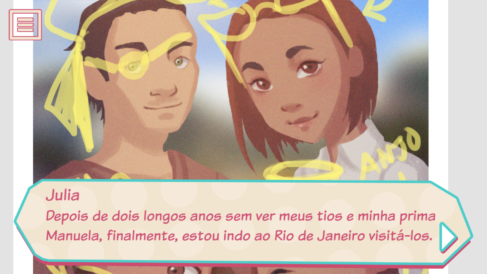
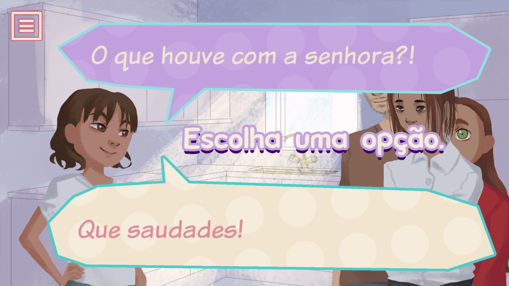
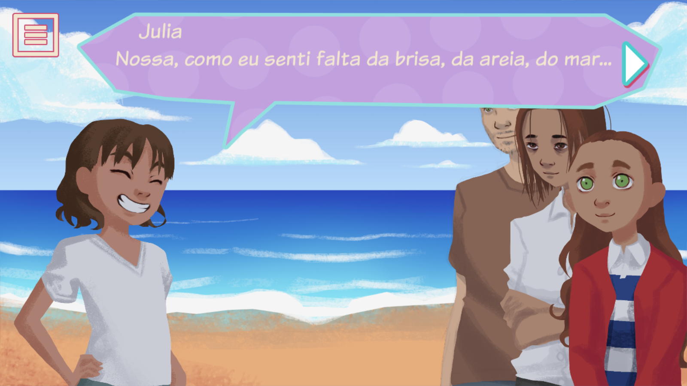
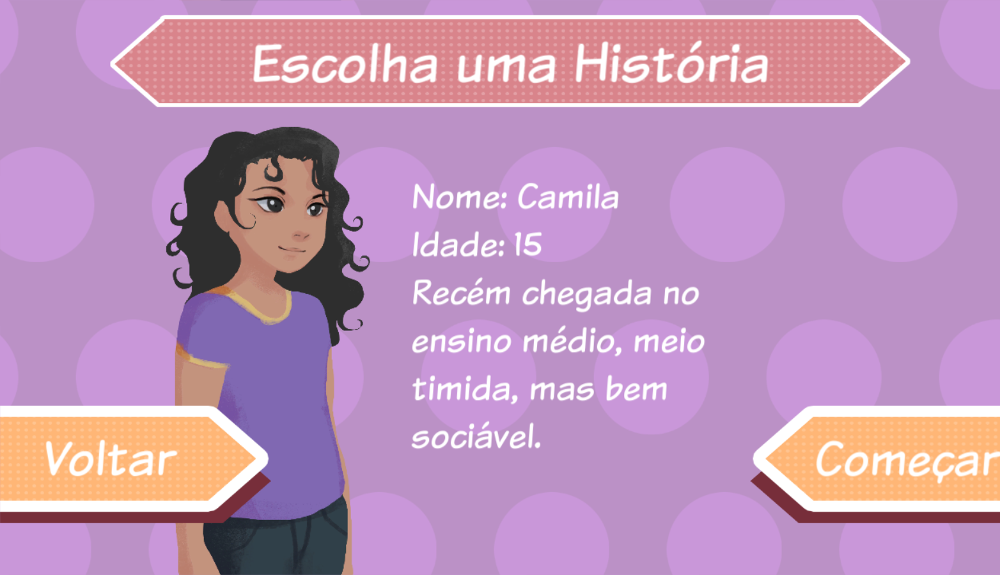
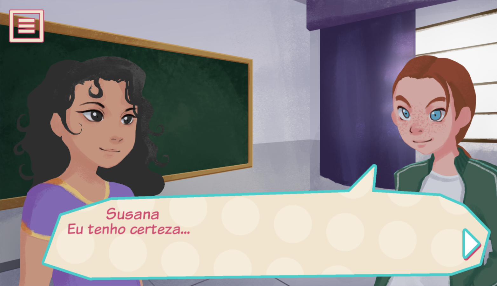

# Todas Unidas

Unity version: 2017.1.1f1

[EN] Mobile game develped in Unity for 4º Semester Game Design Course at Anhembi Morumbi.

Todas Unidas is a mobile serious game, a visual novel in which every chapter we get to know the story of a different girl, your objective is to make the right choice, gather information and understand the important message the game is trying to show.

Responsible for everything inside Unity and did all the coding.

[PT] Jogo mobile desenvolvido na Unity para o Inter do 4º Semestre do curso de Design de Game da Anhembi Morumbi.

Todas Unidas é um serious game mobile, visual novel onde a cada novo capitulo conheceremos a história de uma garota diferente onde o objetivo é selecionar as escolhas corretas, coletar informações e entender a importante mensagem que o game tenta passar.

Responsável pela Unity e escrevi todo o código.

## Gameplay Video

Todas Unidas gameplay video: https://youtu.be/9zer0-K7eEg

## Screenshots

## Build

Link to download: https://drive.google.com/open?id=1hiwWqSIuzdyrmPftrp3YCkGlz0xxg-wG

## Authors
- **Rafael Taue** - Game Designer and Programmer - [GitHub](https://github.com/rtaue) - [Porfolio](https://rtaue.com) - [LinkedIn](https://www.linkedin.com/in/rtaue/)
- **Laís Rodrigues** - Game Designer and Artist - [ArtStation](https://www.artstation.com/marim) - [LinkedIn](https://www.linkedin.com/in/la%C3%ADs-rodrigues-548261149/)
- **Graziela Andreatta** - Game Designer and Story Teller - [LinkedIn](https://www.linkedin.com/in/graziela-andreatta-620871136/)
- **Gabriel Grego** - Game Designer - [LinkedIn](https://www.linkedin.com/in/gabriel-de-souza-grego-028754138/)
- **Thais Nogueira** - Game Designer and Story Teller
